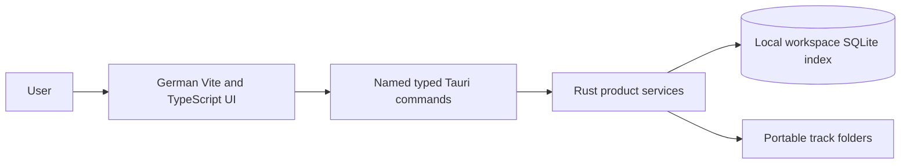

<!-- AUTO-GENERATED:backlink START -->
[← Back](def.md)
<!-- AUTO-GENERATED:backlink END -->
# Application architecture

| Field | Value |
| --- | --- |
| Status | Active |
| Owner | Project team |
| Last review | 2026-08-13 |
| Audience | Contributors orienting themselves in the product |
| Related ATP | [ATP-0013: End-to-end offline workflow](../atp/active/ATP-0013-end-to-end-offline-workflow.md) |

## Purpose

This page is the short architecture entry point for Suno Documentation Manager. It replaces the generated template's full-stack context with the actual local desktop runtime and directs readers to the detailed product definitions.

## Scope

### Included

- the active product profile and runtime units;
- component and trust boundaries;
- local data authorities; and
- links to detailed design and acceptance coverage.

### Excluded

- the master template's optional FastAPI, PostgreSQL, cloud, and container designs;
- detailed track fields, workflow conditions, and SQLite lifecycle; and
- build and packaging instructions.

## Active runtime

Suno Documentation Manager is generated with the `desktop-local` profile. The product runtime contains a Vite/TypeScript user interface inside Tauri 2 and native Rust product services. It contains no backend directory, FastAPI service, PostgreSQL connection, deployment service, or required HTTP server. Normal product use is fully offline.



The TypeScript layer renders navigation, conditional questions, status, and controlled results. It never executes SQL, writes arbitrary local paths, or calculates the authoritative integrity result. Rust owns workspace, track, workflow, evidence, document, artwork, hash, certificate, revision, and persistence operations behind narrow commands.

## Repository mapping

```text
frontend/             TypeScript UI and typed native adapter
src-tauri/            Rust command boundary and product services
workflows/            Versioned declarative Suno workflow
docs/def/             Product and domain definitions
docs/usr/             User task guides
docs/dev/             Import and contributor guidance
docs/atp/             Planned and executed acceptance protocols
tools/control.py      Development lifecycle command
```

`backend/` and `deployment/` are not active product units. Generic inherited documents about database or deployment features describe template background only and do not override this product architecture.

## Trust boundary

The webview is untrusted. Native commands accept typed domain input rather than raw SQL, arbitrary action names, shell snippets, or unrestricted paths. Rust canonicalizes workspace and track roots, rejects traversal and symbolic-link components observed during path validation, performs collision checks, uses atomic managed writes, and returns controlled errors for expected failures. The path-based version 0.1 implementation does not claim descriptor-relative protection against a same-user concurrent process swapping a component after validation; see the [detailed threat-model boundary](product-architecture.md#version-01-threat-model-boundary).

Tauri permissions stay minimal. The product does not add a global filesystem allowlist. User-selected source evidence is copied into a calculated contained destination and is never removed during import.

## Data authority

| Data | Authority |
| --- | --- |
| Workspace defaults, indexes, mutable workflow state, evidence metadata, and UI work state | `<workspace>/.suno-doc/workspace.sqlite` |
| Imported evidence, generated track documentation, integrity lists, certificate artifacts, and archived revisions | Portable track folder |

The application can scan and reindex an existing track folder. Missing historical facts remain unknown or `NOT VERIFIED`; they are never inferred solely from a filename. Finalized folders remain understandable and hash-verifiable without the database or application.

## Product services

| Service | Primary responsibility |
| --- | --- |
| `WorkspaceService` | Workspace creation, opening, validation, and scan |
| `TrackService` | Track lifecycle, facts, and standard folder structure |
| `WorkflowService` | Ten-step evaluation, conditions, missing items, progress, and readiness |
| `EvidenceService` | Contained collision-safe import, metadata, and verification |
| `DocumentService` | Versioned deterministic factual documents |
| `ArtworkService` | Preserved stages and local visible AI disclosure |
| `HashService` | Native SHA-256 generation and complete verification |
| `CertificateService` | Gate, manifest, certificate, invalidation, and revision |
| `PersistenceService` | SQLite connection, migrations, transactions, and recovery index |

## Verification

Reviewers confirm the `desktop-local` profile, absence of product backend/deployment units, narrow command registration, minimal Tauri capabilities, and offline integration behavior. Planned commands run from the repository root:

```sh
python tools/control.py doctor
python tools/control.py tauri doctor
python tools/control.py test --suite all --report
python tools/control.py build desktop
```

This page records no execution result. Acceptance evidence belongs in [ATP-0012](../atp/active/ATP-0012-filesystem-containment.md) and [ATP-0013](../atp/active/ATP-0013-end-to-end-offline-workflow.md).

## Risks and limitations

- Integrity hashes detect change but do not establish identity, authorship, or legal compliance.
- Direct external edits can invalidate a finalized certificate and require a new revision.
- Some unfinished form values cannot be recovered after index loss unless they were exported into the portable track.
- A workspace writable by an untrusted process running as the same operating-system user is outside the version 0.1 containment claim because a path-component swap can race validation and later I/O.

## Related documents

- [Detailed product architecture](product-architecture.md)
- [Track documentation model](track-documentation-model.md)
- [Local persistence and recovery](persistence.md)
- [Workflow model](workflow-model.md)
- [Getting started](../usr/getting-started.md)

## Change log

| Date | Change | Author |
| --- | --- | --- |
| 2026-08-13 | Clarified the version 0.1 same-user symbolic-link race boundary. | Project team |
| 2026-08-13 | Replaced inherited full-stack architecture with the active local desktop product context. | Project team |
