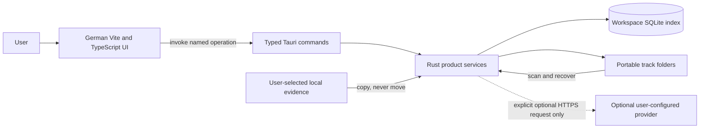
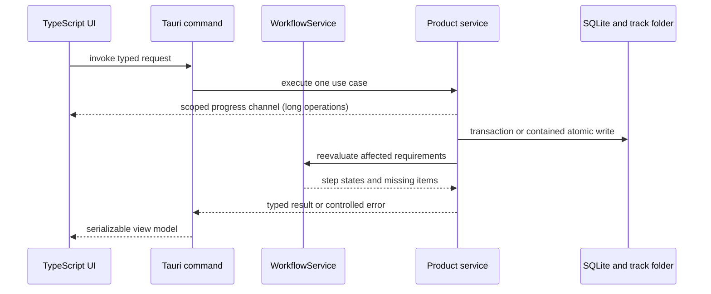

<!-- AUTO-GENERATED:backlink START -->
[← Back](def.md)
<!-- AUTO-GENERATED:backlink END -->
# Suno Documentation Manager product architecture

| Field | Value |
| --- | --- |
| Status | Active |
| Owner | Project team |
| Last review | 2026-08-18 |
| Audience | Product developers and architects |
| Related ATP | [Active product acceptance](../atp/active/active.md) |

## Purpose

This document defines the runtime components, trust boundaries, command contracts, and non-goals of Suno Documentation Manager version 0.1. It answers how a local-first desktop application turns user input and evidence files into a portable track documentation snapshot.

## Scope

### Included

- the Vite, TypeScript, Tauri 2, Rust, SQLite, and track-folder boundaries;
- native service responsibilities and typed command categories;
- local-only security, filesystem, and error-handling rules;
- the relationship between the workspace index and portable track folders; and
- architectural requirements mapped to acceptance plans.

### Excluded

- individual database table and document-template fields;
- user-interface layout details;
- a general-purpose workflow engine;
- cloud, server, synchronization, and remote backup designs; and
- legal interpretation of track contents or evidence.

## Context

The product is generated from the `desktop-local` template profile. Its product runtime is one Tauri desktop process. Development can use Vite as Tauri's asset server, but product behavior never depends on a local HTTP application server. A packaged build loads bundled frontend assets and remains usable without a network connection. Optional external-provider features remain disabled until the user deliberately configures and starts them; the ordinary documentation, integrity, and finalization workflow is local.

The webview is an untrusted presentation client. It may collect input, render state, and request a named operation. It does not receive unrestricted filesystem access, raw SQL access, or an arbitrary native-operation interface.

## System context



There is no backend service, remote database, telemetry endpoint, cloud dependency, or required runtime network edge. The only runtime network edges are optional and user-started: a configured external timestamp provider after finalization and an ACRCloud identification request in Step 09. Neither is contacted during startup, import, replacement, document/hash generation, verification, workflow evaluation, or finalization.

## Runtime responsibilities

| Component | Responsibility | Must not do |
| --- | --- | --- |
| Vite and TypeScript UI | Render navigation, the album/single library hierarchy, conditional questions, progress, missing items, controlled errors, and typed command results | Execute SQL, calculate authoritative hashes, manipulate arbitrary paths, or make legal determinations |
| Tauri command layer | Deserialize typed input, select one use case, return typed success or controlled error data | Expose arbitrary SQL, arbitrary shell commands, or a generic filesystem operation |
| `WorkspaceService` | Create, open, validate, and scan a workspace; manage its local index | Select a workspace without explicit user action |
| `TrackService` | Create, load, update, organize, and safely structure a track | Silently replace an existing track or evidence file |
| `WorkflowService` | Evaluate declared steps, conditions, missing requirements, progress, and finalization readiness | Infer facts not confirmed by the user or generalize into an unrelated workflow engine |
| `EvidenceService` | Validate roles and file types, choose contained destinations, copy files, detect collisions, record explicit provenance and lineage, archive indexed-legacy removals, and trigger reevaluation | Delete the import source, silently overwrite a destination, or infer generated provenance from a role or filename |
| `DocumentService` | Render versioned factual Markdown and text templates deterministically and write atomically | Invent legal conclusions or write managed content over an unmanaged file without consent and backup |
| `ArtworkService` | Produce a local visible disclosure while preserving the AI original and documenting the process | Replace an original image or label project policy as a universal legal requirement |
| `AudioScreeningService` | Run the bundled verified Chromaprint engine against authoritative release evidence; create bounded, explicit ACRCloud sample requests and portable technical records | Use a system executable, upload a Chromaprint fingerprint, retry or contact a provider in the background, expose credentials, or make a legal/rights conclusion |
| `HashService` | Generate and verify SHA-256 records using native Rust code | Depend on a shell command for normal product behavior or hash excluded mutable areas |
| `CertificateService` | Validate the finalization gate, produce certificate artifacts, expose stable anchors, durably stage/register/publish certificate-bound external-timestamp addenda, reverify current and archived published bytes, detect later mismatch, invalidate, archive, and revise | Assert authorship, timestamp qualification, legal compliance, evidentiary weight, or governmental certification; auto-adopt unregistered timestamp metadata |
| `PersistenceService` | Own the SQLite connection, transactions, migrations, and index recovery | Accept raw SQL from TypeScript or make SQLite the only surviving track record |

## Typed command boundary

The command surface is deliberately explicit. The exact Rust input and output structs are part of the native contract, and expected I/O failures return user-readable errors rather than panicking.

| Use case | Named commands |
| --- | --- |
| Workspace | `create_workspace`, `open_workspace`, `scan_workspace` |
| Track | `create_track`, `load_track`, `update_track`, `update_track_library`, `rename_album` |
| Evidence | `import_evidence`, `preview_evidence`, `remove_evidence`, `verify_evidence` |
| Global evidence | `list_global_evidence`, `import_global_evidence`, `import_global_terms_evidence`, `update_global_terms_evidence_metadata`, `remove_global_evidence`, `attach_global_evidence` |
| Documents | `generate_documents` |
| Artwork | `generate_artwork_disclosure` |
| Audio screening | `run_local_audio_screening`, `run_external_audio_screening`, `get_audio_screening_settings`, `update_audio_screening_settings`, `update_audio_screening_secret`, `test_audio_screening_provider` |
| Integrity | `calculate_hashes`, `verify_hashes` |
| Gate, addendum, and revision | `validate_track`, `finalize_track`, `attach_external_timestamp`, `invalidate_certificate`, `create_revision` |

A command accepts domain identifiers and constrained values. It does not accept an operation name, arbitrary SQL, or an unconstrained write path. Path selection happens through a native dialog or a validated path already associated with the open workspace.

Long-running `generate_documents`, `calculate_hashes`, `verify_hashes`, `run_local_audio_screening`, `run_external_audio_screening`, and `finalize_track` requests also receive one scoped Tauri IPC channel. Each command clones the path-based workspace service and dispatches its blocking filesystem work through Tauri's blocking runtime, outside the webview/main thread. The native service sends one-way `OperationProgress` values containing a named phase, byte and file counters, and an optional root-relative current file. Audio-screening progress identifies local preparation/fingerprinting or the explicit bounded external request without disclosing secrets. Document progress advances as managed outputs are written. Integrity progress advances from bytes read through bounded native streams and covers both calculation and the mandatory immediate verification pass. Finalization progress covers native gate validation, certificate publication and verification, the final integrity reread, and authoritative snapshot persistence. Closing the receiving view does not turn a completed native operation into a failure, and the command's final typed result—not a progress message or UI percentage—remains authoritative.

## Service interaction



Native services may coordinate with each other. The UI never tries to reproduce finalization, containment, or integrity decisions on its own. UI calculations can improve responsiveness, but the native result remains authoritative for state-changing operations.

## Workspace and path boundary

Every workspace is selected by the user and canonicalized before use. Product-managed index data lives below `<workspace>/.suno-doc/`; portable evidence and documentation live below individual track roots. The native layer enforces these invariants:

1. Canonicalize the workspace root and every existing path component.
2. Reject `..`, absolute injected paths, and destinations outside the owning root.
3. Reject a symbolic-link path that escapes the workspace or track root.
4. Restrict every write to a destination calculated for a named product operation.
5. Write generated text and metadata to a temporary sibling file, synchronize as required, and rename atomically.
6. Detect a destination collision before copying or generating.
7. Keep the source evidence file unchanged.
8. Return an actionable error with no partial database claim when the file operation fails.

Tauri capabilities remain minimal. The application does not add a global filesystem allowlist such as `/**`.

Create-only files and evidence copies are first completed in a temporary sibling and then published with a no-clobber filesystem operation. The concrete operating-system mechanism can differ by platform and filesystem; the product does not claim that publication is universally hard-link-free or compatible with every removable medium. Support claims require an identified filesystem execution that proves complete bytes, source preservation, occupied-destination preservation, and temporary-file cleanup. The current removable-media regression evidence covers the identified Linux/exFAT fixture in ATP-0012 only.

### Version 0.1 threat-model boundary

The containment boundary protects the native command surface from webview-supplied absolute paths, traversal components, and symbolic-link components that exist when a path is checked. Product-managed paths do not intentionally support symbolic links, even when a link target would currently resolve inside the workspace.

Version 0.1 does not provide descriptor-relative filesystem operations for the complete validate-and-use sequence. Another process running as the same operating-system user, with permission to modify the selected workspace, could attempt to replace a checked path component with a symbolic link before a later open, copy, rename, or delete. That same-user symbolic-link time-of-check/time-of-use race is outside the version 0.1 protection claim. Workspaces shared with an untrusted concurrent writer are unsupported. The residual risk and required race-oriented acceptance work remain open in [ATP-0012](../atp/active/ATP-0012-filesystem-containment.md); existing symbolic-link rejection must not be described as closing that item.

## Data authority

```text
Workspace-local operational state
└── .suno-doc/workspace.sqlite              authoritative index

Portable finalized track state
└── <track-folder>/                         authoritative evidence snapshot
    ├── imported evidence
    ├── generated documentation
    ├── SHA256SUMS.txt
    ├── certificate, manifest, and root-level technical PDF
    └── archived revisions
```

SQLite makes local interaction transactional and efficient. It is intentionally rebuildable from track folders where the folder contains enough information. A final track remains understandable and verifiable if `.suno-doc/` or the application is unavailable. See [Persistence and recovery](persistence.md).

Evidence metadata distinguishes `managed_copy`, `global_copy`, `generated_disclosure`, and `indexed_legacy`. Generated disclosure records link to the verified AI-original evidence ID and retain the generator version and exact disclosure text. Those portable manifest fields allow a reviewer and the native gate to distinguish local derivation from a manually imported look-alike.

Finalization renders `SunoDM_DOCUMENTATION_CERTIFICATE.pdf` (English) and `SunoDM_DOCUMENTATION_CERTIFICATE_DE.pdf` (German) locally in native Rust from the same frozen track/profile/step/evidence snapshot as the JSON manifest and Markdown certificate. Both fixed root PDFs are excluded from the earlier `SHA256SUMS.txt` set to avoid cycles; their complete SHA-256 digests are instead required entries in `06_CERTIFICATE/CERTIFICATE_SHA256.txt`. The certificate directory and both root PDFs share one marker-backed staging, verification, rollback, recovery, and revision lifecycle.

The pre-release audio-screening service is local by default. Its bundled pinned Chromaprint runner is selected by application target and hash-checked before direct execution; it does not use the `PATH`, a user-selected executable, or a substitute hash-based algorithm. The resulting `03_DOCUMENTATION/AUDIO_SCREENING/LOCAL_FINGERPRINT.json`, detached `LOCAL_FINGERPRINT.sha256`, and `AUDIO_SCREENING.md` are portable phase-one documentation and therefore flow through normal document freshness and SHA-256 integrity processing. ACRCloud is an optional, separate user-started HTTPS edge: secrets stay in workspace-local private configuration, the request uses only a bounded audio sample, and its structured result plus any safe provider response are archived as normal hash-covered documentation artifacts. It cannot block finalization or alter a finalized snapshot.

Post-finalization timestamp attachment uses a separate two-authority transaction: create and verify immutable sidecar-v1 bytes in contained staging, synchronize the completed stage and parent, register the certificate-bound row in SQLite, then publish and synchronize the registered directory live. A compensating database rollback occurs only after live removal is parent-synchronized; otherwise the registration remains recoverable. Workspace recovery completes only matching registered pending state, discards unregistered staging, and rejects an unregistered live sidecar. Load verification requires the canonical immutable record bytes, rejects injected runtime/trust claims even with a renewed hash list, and hashes the published addendum bytes and pinned Markdown/PDF digests without invoking the current renderer; the mutable current integrity result exists only in the returned view model. Revision lookup requires `revision.json.previous_certificate.certificateId` to match the sidecar, keeping registered archived records visible and independently verifiable without folding them into the base certificate result.

Evidence import is dispatched as blocking native work rather than running on the webview event loop. Copy and SHA-256 calculation share one bounded-buffer stream. Routine track loading performs metadata checks instead of repeatedly hashing evidence above 64 MiB; explicit verification and integrity/finalization remain full checks. Preview commands embed only bounded images or text, and treat project ZIPs as metadata-only. An explicit replacement preserves the evidence ID, archives the previous bytes, and coordinates the filesystem change with the SQLite update so an occupied `(track_id, relative_path)` never becomes a raw user-facing uniqueness error.

Profile updates and their non-finalized track snapshots are committed in one SQLite transaction. The native service marks affected documents stale and resets integrity; finalized and superseded snapshots are deliberately skipped. The frontend reloads the current track after the update, so workflow rails, missing items, and generated Markdown all evaluate the same embedded profile values.

Track library placement is synchronized between the workspace index and physical folder hierarchy. Workspace opening ensures `Singles/` exists; `create_album` creates an empty named physical album folder, and `list_albums` exposes physical albums independently of their track count. `create_track` creates `Singles/<track>/` or `<album>/<track>/`; `update_track_library` moves the complete track root and then persists its new relative path. `rename_album` moves one album directory, including an empty album, and updates all member paths in a single SQLite transaction. These organizational commands deliberately bypass content-edit lifecycle restrictions so a finalized track can be reorganized without changing its update timestamp, workflow, documents, integrity state, certificate, or bytes below the track root. Destination collisions never overwrite, and a failed database write triggers a compensating folder move. The general `update_track` command retains its existing content-change and invalidation behavior; when the editable title changes, it also renames the track leaf folder.

## Product requirements and ATP mapping

| Requirement | Architectural acceptance criterion | Acceptance plan |
| --- | --- | --- |
| `REQ-ARC-001` | A packaged runtime has no backend, remote service, or required network connection. | [ATP-0013](../atp/active/ATP-0013-end-to-end-offline-workflow.md) |
| `REQ-ARC-002` | TypeScript reaches native behavior only through named typed Tauri commands. | [ATP-0012](../atp/active/ATP-0012-filesystem-containment.md) |
| `REQ-ARC-003` | Native writes are contained, collision-aware, and atomic where content is generated. | [ATP-0012](../atp/active/ATP-0012-filesystem-containment.md) |
| `REQ-ARC-004` | Workspace index loss does not make a complete track folder unintelligible. | [ATP-0011](../atp/active/ATP-0011-local-persistence-and-recovery.md) |
| `REQ-ARC-005` | Expected I/O, validation, and migration failures return controlled errors without a Rust panic. | [ATP-0011](../atp/active/ATP-0011-local-persistence-and-recovery.md) |
| `REQ-ARC-006` | On every local filesystem explicitly claimed as supported, create-only and evidence-copy publication succeeds without replacing an occupied destination, deleting the source, or leaving a temporary file. | [ATP-0012](../atp/active/ATP-0012-filesystem-containment.md) |
| `REQ-ARC-007` | Local screening uses only the verified bundled engine and explicit ACRCloud screening is bounded, credential-safe, and non-blocking. | [ATP-0017](../atp/active/ATP-0017-pre-release-audio-screening.md) |

## Verification

Reviewers inspect the active profile, dependency graph, Tauri capabilities, command registration, and absence of backend or deployment units. The following planned checks run from the repository root; this page records no execution result.

```sh
python tools/control.py doctor
python tools/control.py tauri doctor
python tools/control.py test --suite tauri
python tools/control.py test --suite frontend
rg -n "FastAPI|postgres|execute_sql|execute_file_operation" frontend src-tauri project-profile.toml
rg -n "COPYRIGHT[_]SAFE|INFRINGEMENT[_]FREE|LEGAL[_]SAFE" frontend src-tauri docs workflows
```

Acceptance owners execute [ATP-0012](../atp/active/ATP-0012-filesystem-containment.md) and [ATP-0013](../atp/active/ATP-0013-end-to-end-offline-workflow.md) against an identified build.

## Risks and limitations

- A desktop process still handles untrusted filenames and large media; containment, size handling, and controlled errors require native tests.
- Path checks are not descriptor-relative across the complete operation; a hostile same-user concurrent writer can attempt a symbolic-link swap after validation. Such shared writable workspaces are outside the version 0.1 threat model and remain an open ATP item.
- A portable folder can be edited outside the application. Integrity verification detects changes but cannot prevent them.
- Development dependency installation can require internet access. Normal product runtime use does not require a connection; a deliberate external timestamp or ACRCloud request does.
- External screening depends on a user-configured third party and a packaged target-specific engine. Provider unavailability, configuration errors, unsupported formats, and unavailable target runners remain non-positive technical results.
- The current removable-media compatibility result is limited to the identified Linux/exFAT fixture; other operating systems and filesystems retain their own acceptance obligation.
- The certificate is a workflow artifact, not a legal or identity credential.

## Related documents

- [Track documentation model](track-documentation-model.md)
- [Track library organization model](track-library-model.md)
- [Persistence and recovery](persistence.md)
- [Workflow model](workflow-model.md)
- [Pre-release audio screening](pre-release-audio-screening.md)
- [Legacy track import](../dev/legacy-track-import.md)
- [Finalizing a track](../usr/finalizing-a-track.md)
- [Framework architecture inherited from the template](architecture.md)

## Change log

| Date | Change | Author |
| --- | --- | --- |
| 2026-08-18 | Added the local Chromaprint and explicit optional ACRCloud screening boundary, provider network edge, portability/integrity rules, and ATP-0017 mapping. | Project team |
| 2026-08-17 | Added the sidecar-v1 database-before-live publication, recovery, immutable-byte verification, and archived-sidecar architecture. | Project team |
| 2026-08-17 | Added the typed Terms-metadata update and post-finalization external-timestamp command boundaries, including the prohibition on legal qualification claims. | Project team |
| 2026-08-15 | Extended native progress and blocking-runtime dispatch through certificate finalization. | Project team |
| 2026-08-15 | Moved progress-capable document and integrity work off the Tauri main thread so animation and IPC updates remain responsive. | Project team |
| 2026-08-15 | Added the scoped native progress-channel contract for document generation and integrity operations. | Project team |
| 2026-08-15 | Synchronized profile changes into open tracks, corrected prerequisite-aware step status, and moved lyrics/style outputs into `02_SUNO`. | Project team |
| 2026-08-14 | Replaced virtual-only library placement with synchronized physical album/single paths and atomic album-folder rename. | Project team |
| 2026-08-14 | Added the typed library-assignment boundary and separated virtual reclassification from portable track mutation. | Project team |
| 2026-08-14 | Defined filesystem-scoped no-clobber publication acceptance and documented the global-evidence command boundary. | Project team |
| 2026-08-13 | Added evidence-lineage ownership and the explicit same-user symbolic-link race boundary. | Project team |
| 2026-08-13 | Defined the local-only product architecture and trust boundaries. | Project team |
