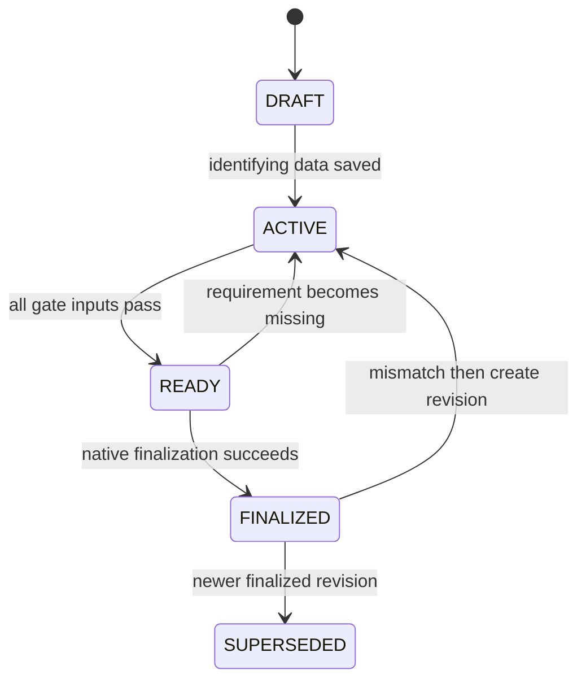

<!-- AUTO-GENERATED:backlink START -->
[← Back](def.md)
<!-- AUTO-GENERATED:backlink END -->
# Suno track workflow model

| Field | Value |
| --- | --- |
| Status | Active |
| Owner | Project team |
| Last review | 2026-08-17 |
| Audience | Product developers and acceptance owners |
| Related ATP | [ATP-0008: Finalization gate](../atp/active/ATP-0008-finalization-gate.md) |

## Purpose

This document defines the versioned ten-step Suno track workflow, conditional applicability, missing-item calculation, progress, lifecycle states, and finalization gate. It answers how the application decides what to ask and whether a track can be finalized.

## Scope

### Included

- the `suno-track` workflow identity and steps;
- track and step statuses;
- conditional questions and justified non-applicability;
- progress and missing-requirement calculation;
- finalization, invalidation, revision, and workflow-version behavior; and
- mappings from requirements to acceptance plans.

### Excluded

- a user-authored or general-purpose workflow engine;
- arbitrary expression execution;
- legal conclusions based on content-check answers;
- automatic upgrade of an old finalized certificate; and
- visual styling beyond required status information.

## Declarative boundary

The repository file [workflows/suno-track.toml](../../workflows/suno-track.toml) declares one supported workflow:

```toml
schema_version = 1
id = "suno-track"
version = "1.6"
name = "Suno Track Documentation"
```

The file declares fixed step IDs, ordering, required flags, blocker states, requirement keys, and a small closed set of supported conditions. Rust parses the file into typed internal structures and rejects an unsupported schema, duplicate step, unknown condition kind, invalid dependency, or missing required step. The frontend renders the resulting typed view model. Version 0.1 does not evaluate arbitrary scripts or expressions.

## Track lifecycle

| Status | Meaning | Allowed direction |
| --- | --- | --- |
| `DRAFT` | The track exists but required identifying facts may be incomplete. | `ACTIVE` |
| `ACTIVE` | Documentation work is in progress. | `READY` |
| `READY` | Current evaluation satisfies the non-certificate gate and can be finalized. | `ACTIVE`, `FINALIZED` |
| `FINALIZED` | Certificate artifacts match the finalized portable snapshot. | invalidation followed by revision, or `SUPERSEDED` |
| `SUPERSEDED` | A newer revision is the preferred current snapshot. | Terminal for that archived revision |

Read-only legacy discovery can present a track as incomplete without inventing a new lifecycle state. Its unresolved imported steps use `NOT VERIFIED` and therefore prevent `READY`.



## Step statuses

| Display status | Meaning | Blocks a mandatory step? |
| --- | --- | --- |
| `NOT RUN` | No valid evaluation result exists. | Yes |
| `PASS` | The applicable step satisfies its declared requirements. | No |
| `FAIL` | An evaluated requirement failed. | Yes |
| `BLOCKED` | A prerequisite or blocking deviation prevents completion. | Yes |
| `N/A` | The step or requirement is not applicable and has a stored reason. | No, only with a non-empty reason |
| `NOT VERIFIED` | A historical value or file was discovered but cannot be verified. | Yes |

An empty N/A reason is invalid. A conditional child requirement can become N/A automatically only with a deterministic stored reason that identifies the controlling answer, for example `Not applicable: external audio uploaded is No`. A historical `NOT VERIFIED` result remains blocking only while its current requirements are missing; once the profile, fields, and evidence satisfy them, reevaluation promotes the step to `PASS`.

## Ordered steps

| Order | Step ID | Label | Primary responsibility |
| --- | --- | --- | --- |
| 01 | `track` | Track | Title, production dates, commercial intent, and workflow identity |
| 02 | `source` | Source | Guided external, own, code-based, and third-party source branches plus applicable rights and evidence |
| 03 | `suno` | Suno | Model, project URL, user-confirmed or evidence-derived final-generation date, optional exact download date, plan, export evidence, and filename confirmation; embedded generation timestamp/ID are system-observed evidence metadata rather than manual workflow inputs |
| 04 | `human-work` | Human Work | Lyrics source/text, Suno style prompt, and guided human or post-export edits that actually occurred |
| 05 | `artwork` | Artwork | Artwork origin, process stages, evidence roles, and conditional content check |
| 06 | `ai-transparency` | AI Transparency | AI service and visible-disclosure policy/result unless all three content checks are explicitly `No` |
| 07 | `release` | Release | Final release audio, guided release-note choices, and export facts |
| 08 | `evidence-licenses` | Evidence & Licenses | Subscription evidence covering the concrete final-generation date plus the portable copy of globally registered terms evidence or an explicit unavailable status |
| 09 | `integrity` | Integrity | Current generated documents, SHA-256 list, complete native re-verification, and no mismatch |
| 10 | `finalize` | Finalize | Blocking-deviation check and native certificate transaction |

All ten steps exist exactly once. The UI shows one task-oriented step at a time and a dashboard summary rather than presenting every possible field in one form.

## Conditional model

Conditions use a closed vocabulary over typed track answers:

- boolean equality, such as `external_audio_uploaded = true`;
- enumerated equality, such as `artwork_origin = "ai-assisted"`;
- evidence-role presence;
- non-empty confirmed text for a required note; and
- completion or freshness of a named native artifact.

The following branch rules are mandatory:

| Controller | When negative or absent | When positive or applicable |
| --- | --- | --- |
| External audio uploaded | Hide dependent source/license requirements and exclude them from evaluation | Require source, ownership, license evidence, and uploaded file |
| Own audio uploaded | Hide own-audio details | Require confirmed ownership/source details and file role |
| Code-based generation | Hide code-generation evidence and the post-processing question | Require one supported source-code/source-text file and its generated WAV or MP3 under `02_SUNO/`; require an explicit post-processing answer |
| Code-audio post-processing | Do not request operations and do not generate editing claims | Require one or more selected operations; an optional free-text note is retained only with `Other post-processing` |
| Third-party samples uploaded | Hide sample details | Require sample source, permission/license note, and applicable evidence |
| Lyrics source | Instrumental hides lyrics text | Every non-instrumental source requires the exact text used; the Suno style prompt is always required |
| Human or post-export editing | Do not add generic editing claims | Require at least one specific operation from the applicable guided multi-selection |
| Artwork origin | Hide process fields that do not match the selected origin | Human artwork can record multiple process operations plus editable notes; AI-assisted artwork requires at least one selected human change |
| AI-generated or AI-assisted artwork | Permit the whole AI Transparency step to be stored as N/A only with a reason | Require AI original and one final artwork under Artwork. If all three content checks are `No`, deactivate AI Transparency; otherwise require service, policy decision, disclosure result, and locally generated provenance/source lineage when disclosure applies |
| Real person, real event, trademark, or logo content check | End that question | Require a factual note and any configured evidence; do not decide legality |
| External license evidence | Do not ask for unrelated license fields | Require evidence selection, contained copy, and integrity inclusion |

Changing a controller reevaluates and clears the requirement status of now-hidden dependent fields. Historical values are not silently presented as current answers; removal follows an explicit domain rule or confirmation.

Source categories, rights bases, human-work operations, post-export operations, and release-note selections use stable English values with localized presentation labels. This keeps generated document choices English without requiring the interface itself to be English. Unknown historical free text remains reviewable as a legacy option until the user deliberately replaces it.

Suno model and plan-at-creation remain unrestricted strings. The UI offers current suggestions, but a historical, custom, or future value is valid and must round-trip exactly; the evaluator checks only that the applicable string is non-empty.

## Evidence-derived Suno automation

When a verified `suno_final_export` WAV contains bounded structured metadata with the `made with suno studio` marker and a valid `created` value, the native layer records the exact embedded timestamp and its evidence ID and SHA-256 origin. A valid embedded `id` is retained independently but is never required for date derivation or finalization. The application derives the calendar date from `created`; it does not treat the import time, file modification time, filename, or any other filesystem value as a generation fact.

For an editable track, a valid derived date is authoritative for the final-generation date, production-end date, and optional download/export date. These values are assigned from `created` and remain read-only while that metadata date exists. Step 07 asks whether the WAV was edited again on the desktop PC: `No` derives and locks the last-editing date from `created`; `Yes` requires a user-confirmed last-editing date and the performed work. Without valid metadata, manual fallback remains available.

Subscription receipts are individually relevant when their interval overlaps the production period or contains the final-generation date. The native gate evaluates all attached portable receipts together: their inclusive intervals must cover the production period without a gap, and at least one attached receipt must cover final generation.

An evidence-derived value retains its source hash. Replacing the evidence updates both automatic dates, while removing it clears those system-owned values and makes the manual fallback inputs available again. Malformed, incomplete, oversized, or ordinary WAV metadata is ignored without preventing a valid evidence import.

Every verified evidence pair with the same SHA-256 is reported by system verification. The dedicated release result is positive only when the final release audio and Suno final export are byte-identical; it does not rely on their names or timestamps.

## Missing-item calculation

The evaluator returns structured missing items rather than only a percentage. Each item includes a stable requirement key, step ID, German user-facing label, reason, and the view or action that can resolve it.

For each declared requirement:

1. Evaluate its applicability from normalized typed answers.
2. If a requirement is not applicable, exclude it from the applicable denominator. If an entire step is explicitly stored as `N/A`, require and persist a non-empty reason.
3. If applicable, evaluate its field, evidence role, artifact freshness, integrity, deviation, or evidence-consistency predicate.
4. Add a missing item for `NOT RUN`, `FAIL`, `BLOCKED`, or `NOT VERIFIED`.
5. Mark the step `PASS` only when every applicable mandatory requirement passes. `Finalize` remains `BLOCKED` while any preceding step is not `PASS` or justified `N/A`.
6. Derive the track lifecycle without trusting a frontend-provided status.

The UI answers `What is missing?` with concrete items such as Suno project URL, final WAV, AI artwork original, subscription evidence, or an evidence-derived metadata conflict. Consistency issues use the established step result and missing-item mechanisms; they do not form a parallel validation subsystem.

## Progress

Progress is derived, not edited:

```text
completed applicable mandatory requirements
------------------------------------------------ × 100
all applicable mandatory requirements
```

A non-applicable requirement is removed from both numerator and denominator. A justified `N/A` step is accepted only when none of its mandatory requirements apply. Optional requirements do not lower mandatory progress. If no mandatory requirement is applicable, progress is zero until the track identity creates a valid evaluation context. A 100 percent display does not by itself finalize a track; native gate validation still runs.

## Finalization gate

`validate_track` reports readiness and all blocking reasons. `finalize_track` independently reevaluates the same conditions and succeeds only when:

- every applicable mandatory step is `PASS` or justified `N/A`;
- no blocking deviation is open;
- every required evidence role has a present, contained, readable file;
- instrumental, lyrics source/text, and selected `Lyrics` human work are mutually consistent;
- original release and Suno-export filenames either match the documented title or have an explicit intentional-deviation confirmation;
- every evidence-derived fact still matches the identified evidence ID, SHA-256, and embedded value, and the authoritative date fields match that fact;
- a commercial track's recorded final-generation date is inside verified selected subscription coverage;
- commercial intent has both subscription evidence and a portable copy of globally registered archived terms/rights evidence or the explicit `Terms evidence not available` status;
- every policy-required artwork disclosure has `generated_disclosure` provenance, the supported generator version, the exact configured text, a verified AI-original source ID, and bytes identical to final artwork;
- generated documents match their normalized inputs and template versions;
- `SHA256SUMS.txt` exists and covers the required current set;
- native re-verification has verified every listed file; and
- the selected workflow and application versions are recorded.

The Finalize button remains disabled before readiness, or the interface exposes an action that explains every blocking item. A TypeScript state change cannot bypass the native gate.

## Certificate invalidation and revision

Opening or verifying a `FINALIZED` track recalculates the protected integrity state. A mismatch changes the certificate presentation to invalid. The application does not overwrite the previous certificate set.

A finalized track is a read-only UI snapshot: ordinary field, evidence, document-generation, hash-generation, deviation, step-status, and evidence-metadata mutations are unavailable. Opening a finalized legacy snapshot does not parse its WAV files and backfill new facts. Navigation between every workflow step and the main application views remains available, as do evidence previews and read-only integrity verification. A stale browser draft belonging to the locked snapshot is discarded locally instead of being resubmitted on every navigation attempt. `Create new revision and edit` is visible for both valid and invalid finalized certificates without requiring prior invalidation.

Revision creation archives the old certificate artifacts and revision metadata below `.archive/revisions/<revision-id>/`, marks the previous revision superseded when appropriate, and creates an active working revision. The new mutable revision may then analyze carried Suno WAV evidence and persist evidence-derived facts; the archived finalized snapshot remains unchanged. A new certificate requires the complete gate again.

## Workflow versioning

Every track and certificate stores both `workflow_id` and `workflow_version`. A new declarative workflow version does not mutate an old certificate. The UI can show:

```text
Finalized with workflow 1.0
Current workflow version: 1.6
```

Re-evaluation is explicit. Until the stored track version matches the current workflow, new managed documents, hashes, and certificates are blocked so a certificate cannot name an older workflow while applying newer rules. Re-evaluation creates new working state and, after successful acceptance, a new revision; it never rewrites the meaning of an archived `1.0` result.

## Requirements and ATP mapping

| Requirement | Acceptance criterion | Acceptance plan |
| --- | --- | --- |
| `REQ-WFL-001` | The declarative model contains exactly the ten ordered Suno steps and one supported workflow identity/version. | [ATP-0008](../atp/active/ATP-0008-finalization-gate.md) |
| `REQ-WFL-002` | Conditional branches ask only applicable follow-up questions and retain a reason for N/A. | [ATP-0002](../atp/active/ATP-0002-track-creation.md) |
| `REQ-WFL-003` | Missing items and progress derive from applicable mandatory requirements. | [ATP-0008](../atp/active/ATP-0008-finalization-gate.md) |
| `REQ-WFL-004` | `FAIL`, `BLOCKED`, `NOT VERIFIED`, missing evidence, stale documents, and hash failure block finalization. | [ATP-0008](../atp/active/ATP-0008-finalization-gate.md) |
| `REQ-WFL-005` | A workflow version change never retroactively mutates a finalized certificate. | [ATP-0010](../atp/active/ATP-0010-certificate-invalidation-and-revision.md) |
| `REQ-WFL-006` | A finalized snapshot remains read-only and navigable; an explicit archived revision is required before editing or refinalization, and a post-finalization mismatch invalidates the current certificate. | [ATP-0010](../atp/active/ATP-0010-certificate-invalidation-and-revision.md) |
| `REQ-WFL-007` | Native finalization blocks contradictory instrumental facts, stale derivation origins, unconfirmed filename deviations, uncovered commercial generation dates, and missing commercial terms status. | [ATP-0015](../atp/active/ATP-0015-technical-evidence-certificate.md) |
| `REQ-WFL-008` | Valid structured Suno WAV metadata authoritatively derives the final-generation and production-end dates; it never invents a download date or mutates a finalized snapshot. | [ATP-0015](../atp/active/ATP-0015-technical-evidence-certificate.md) |

## Verification

Reviewers parse the workflow, test all supported status transitions, and exercise each branch with table-driven fixtures. Planned commands, run from the repository root, are:

```sh
python tools/control.py test --suite frontend
python tools/control.py test --suite tauri
python tools/control.py test --suite all --report
```

Gate results belong in [ATP-0008](../atp/active/ATP-0008-finalization-gate.md); invalidation and workflow-version results belong in [ATP-0010](../atp/active/ATP-0010-certificate-invalidation-and-revision.md). Each active ATP distinguishes executed evidence from remaining manual checks.

## Risks and limitations

- Incorrect declarative dependencies could hide a required question; parser validation and branch fixtures must cover every controller.
- Progress is an aid, not evidence of finalization; only the native gate can produce a certificate.
- Historical imports can remain blocked indefinitely when facts cannot be recovered honestly.
- A role or manually asserted disclosure flag cannot substitute for persisted local-generation lineage.
- Version 0.1 intentionally supports one bounded workflow and no arbitrary extensions.

## Related documents

- [Declarative Suno workflow](../../workflows/suno-track.toml)
- [Product architecture](product-architecture.md)
- [Track documentation model](track-documentation-model.md)
- [Persistence and recovery](persistence.md)
- [Finalizing a track](../usr/finalizing-a-track.md)

## Change log

| Date | Change | Author |
| --- | --- | --- |
| 2026-08-17 | Raised the workflow to 1.6 for derived download/last-editing dates, the Step-07 desktop-editing decision, and joint subscription-period coverage. | Project team |
| 2026-08-17 | Raised the workflow to 1.5 so a valid Suno metadata date authoritatively fills and locks production end and final generation, while manual fallback is available only without metadata. | Project team |
| 2026-08-17 | Raised the workflow to 1.4 for evidence-derived Suno WAV metadata, conditional date automation, byte-identity verification, consistency blockers, and revision-only legacy analysis. | Project team |
| 2026-08-16 | Advanced the workflow to 1.2 for conditional code-audio post-processing and the required human-change selection on AI-assisted artwork; retained unrestricted Suno model and plan strings. | Project team |
| 2026-08-16 | Advanced the workflow to 1.1 and required generated WAV/MP3 evidence together with source code for a positive code-based-generation answer. | Project team |
| 2026-08-15 | Defined read-only finalized navigation, stale-draft disposal, and direct revision access. | Project team |
| 2026-08-16 | Raised workflow to 1.3 and added final-generation, consistency, filename, coverage, and commercial terms gates. | Project team |
| 2026-08-15 | Added the conditional code-based Source branch, guided Source classifications, and English canonical values for localized choice controls. | Project team |
| 2026-08-15 | Added the Suno style prompt, guided work/release choices, three-negative AI Transparency deactivation, one final-artwork requirement, and prerequisite-aware Finalize status. | Project team |
| 2026-08-13 | Added provenance and source-lineage checks to the AI artwork finalization gate. | Project team |
| 2026-08-13 | Defined the ten-step conditional workflow and finalization gate. | Project team |
