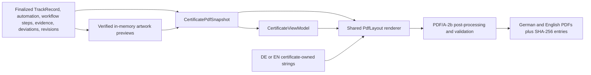

<!-- AUTO-GENERATED:backlink START -->
[← Back](dev.md)
<!-- AUTO-GENERATED:backlink END -->
# Certificate PDF architecture

| Field | Value |
| --- | --- |
| Status | Active |
| Owner | Product team |
| Last review | 2026-08-21 |
| Audience | Certificate-renderer contributors and reviewers |
| Primary implementation | `src-tauri/src/certificate.rs`, `src-tauri/src/certificate_pdf.rs` |
| Related definition | [Pre-release audio screening](../def/pre-release-audio-screening.md) |

## Purpose

This page describes the rendering boundary for the German and English SunoDM Technical Evidence Certificate PDFs. Both files are different language renditions of one finalized evidence snapshot. They must preserve the same facts, evidence identities, full technical records, and integrity anchors while providing a concise first-page summary, a visual evidence overview, and a complete audit section.

The PDF is technical documentation. Its layout and status language must not turn recorded facts into claims about authorship, rights ownership, non-infringement, legality, license validity, judicial evidentiary weight, statutory compliance, or governmental certification.

## Data flow



`certificate.rs` owns orchestration. It serializes the schema-9 manifest and computes its anchor first, invokes the finalization timestamp resolver exactly once, then prepares the Markdown and invokes `generate_pdf` twice with the same captured `FinalizationTimestampSnapshot`, sorted verified evidence, and bounded artwork previews. Only `CertificateRenderOptions.language` differs between the DE and EN calls. Neither PDF renderer contacts a provider or performs provider-specific classification.

`CertificatePdfSnapshot` is the renderer input contract. It borrows the authoritative track, evidence, automation, workflow steps, deviations, revision references, certificate identity, finalization time, and the SHA-256 anchors for `SHA256SUMS.txt`, `EVIDENCE_MANIFEST.json`, and `DOCUMENTATION_CERTIFICATE.md`. It owns the captured finalization timestamp state, including separate provider configuration, concrete technical result, structured protocol checks, signer identity, and optional provider-neutral qualification/Trusted List audit. It also borrows render-only artwork derivatives. Validation rejects contradictory ACRCloud overall/sample match states and a displayed coverage percentage that disagrees with the recorded sampled/source durations. The PDF renderer does not load mutable application state or query SQLite.

`CertificateViewModel::from_snapshot` is the shared, language-independent presentation normalization for the summary and overview. It calculates each displayed summary fact once, including coverage status, workflow counts, open blocking deviations, final-artwork selection, screening status, and the consolidated provider-response summary. German and English renderers therefore cannot independently interpret the same fact. The A–L technical sections continue to read the same immutable snapshot directly so no detail is discarded by the compact view model.

## Responsibility boundaries

| Component | Responsibility | Must not do |
| --- | --- | --- |
| `certificate.rs` | Assemble the finalized certificate input, prepare previews, render both languages, hash and publish the artifact set | Build a language-specific evidence set or mutate registered evidence |
| `prepare_artwork_previews` | Resolve, verify, decode, bound, convert, and deduplicate optional image derivatives | Rewrite source images, repair evidence paths, or change registered hashes |
| `CertificatePdfSnapshot` validation | Enforce identity, digest, ordering, verification, preview-binding, workflow, finalization-timestamp, and qualification-source invariants | Infer missing historical facts or silently accept unverified evidence |
| `CertificateViewModel` | Normalize shared summary and overview facts | Replace the full technical record or localize source values |
| Localization functions | Translate certificate-owned labels and prose for one rendition | Translate user input, evidence filenames, provider text, IDs, or hashes |
| `PdfLayout` | Paginate and draw all shared A4 content, headers, footers, TOC entries, bookmarks, tables, and images | Read files or maintain a second DE/EN layout implementation |
| PDF/A post-processor and validator | Add deterministic archive metadata, compress image streams, and enforce the project PDF/A profile | Treat structural validation as a legal or independent archival certification |

## Localization contract

The renderer uses English source keys for certificate-owned text. `PdfLayout::label` handles short labels and `PdfLayout::paragraph` handles prose through the localization functions in `certificate.rs`. This provides one layout tree and one set of pagination rules for both output files.

The localization boundary is deliberate:

- headings, table labels, explanatory prose, status explanations, TOC titles, headers, and footer labels are localized;
- evidence paths and filenames, certificate/evidence IDs, hashes, workflow IDs and versions, provider-returned messages, and user-recorded values remain exact source data;
- language-specific output must be reviewed for leaked renderer labels, but an English or German word inside an evidence value is not a localization defect; and
- missing data remains explicit (`N/A`, `NOT DOCUMENTED`, `NOT VERIFIED`, or the applicable factual status) and is never translated into an invented fact.

Adding a visible renderer string requires adding its DE mapping at the same time. Do not create a second German drawing function to work around a missing mapping.

## Document composition

The shared renderer emits this sequence:

1. Certificate Summary: track and artist identity, final artwork or a textual fallback, certificate/finalization metadata, compact status groups, and the technical/legal boundary.
2. Evidence Overview: proportional production/subscription timeline, artwork-process previews, proportional audio-sampling visualization, and compact screening/workflow facts.
3. Contents: page numbers sourced from the same bookmark targets used by the PDF outline.
4. Full technical record A–L:
   - A — Certificate / Snapshot Identity
   - B — Track identity
   - C — Final Suno Generation
   - D — Source provenance
   - E — Human contribution
   - F — Suno Generation Text Field, including the classified or legacy-content branch
   - G.1 — AI Transparency Assessment – Audio
   - G.2 — AI Transparency Assessment – Artwork
   - H — License and rights evidence
   - I — External Timestamp Evidence at technical finalization
   - J — Complete evidence register
   - K — Integrity anchors, configured workflow checks, and pre-release audio screening
   - L — Technical certificate statement
5. Technical Appendix: complete numbered ACRCloud sample records and complete previous-revision references when present.

Summary abbreviations do not replace full data. In particular, shortened display hashes are permitted only where the complete SHA-256 remains in the evidence register or integrity section. Long per-sample/provider records and revision paths move to the appendix rather than being removed. The table of contents and PDF outline use one-based page destinations, while the internal layout stores zero-based page indexes.

Every page is A4. Continuation pages use a running track/artist header and a certificate-type subtitle. Every page carries the certificate ID and `Page n / total` footer. Text wrapping and continuation logic must keep values inside the content area; evidence rows and long mono-spaced values may flow across pages but may not be truncated.

## Artwork preview pipeline

Artwork previews are optional render derivatives, not new evidence. The pipeline applies the following controls before a preview can enter `CertificatePdfSnapshot`:

1. Only registered artwork roles are considered. Final/release artwork is prioritized before process artwork so byte-identical roles can share the larger derivative.
2. The registered relative path is resolved through the track-containment guard. A historical case-only path mismatch may use a unique sibling with the same SHA-256 solely as a preview source; the displayed path and evidence identity remain unchanged.
3. The exact source byte length and SHA-256 are compared with the registered evidence item before decoding.
4. Encoded source size plus decoder dimension/allocation limits reject oversized inputs. Final/release derivatives are bounded to 640 pixels on the longest side; process derivatives are bounded to 384 pixels.
5. Transparency is flattened onto white, and the derivative is converted to four-channel CMYK in memory.
6. Byte-identical artwork shares one image resource ID and pixel buffer. Each role still retains its own evidence ID, filename, path, and displayed role.

No derivative is written into the track folder. Source bytes, source metadata, the registered evidence path, and its SHA-256 remain untouched. An absent file, containment failure, byte/hash mismatch, unsupported image, or decode-limit failure suppresses only the optional preview and activates textual fallback content; it does not downgrade or replace the evidence record.

The PDF installs each unique derivative as an 8-bit `/DeviceCMYK` image XObject with interpolation disabled. Image streams are explicitly offered for deterministic Flate compression during post-processing; a high-entropy stream may remain unfiltered when compression would increase its size. PDF/A validation rejects non-positive or oversized dimensions, a non-CMYK colorspace, a bit depth other than eight, interpolation, transparency/mask metadata, or decompressed byte length other than `width × height × 4`.

## PDF/A-2b and deterministic output

The common renderer creates a PDF 1.7 document and then applies the project PDF/A-2b archive profile:

- PDF/A-2b XMP metadata and a document language are attached to the catalog;
- deterministic document/instance identifiers and PDF dates are derived from the certificate identity, rendition language, and finalized timestamp;
- the project archive fonts are embedded in full;
- a CMYK ICC output intent is attached;
- page drawing operations use the matching CMYK color model;
- artwork image streams follow the bounded CMYK contract; and
- encryption is prohibited.

Serialization is followed by an in-process structural validation of XMP, output intent, page colors, image XObjects, embedded fonts, trailer identity, pages, version, and encryption state. A validation error aborts certificate publication. The German and English PDFs are expected to differ because their content and language-specific deterministic seed differ; repeating either rendition from an identical normalized snapshot and identical evidence bytes must produce identical bytes.

The in-process validator proves the SunoDM structural contract. Independent PDF/A review with a maintained external validator remains useful for release acceptance and must not be described as already performed unless its report was retained.

## Snapshot, integrity, and secrets boundary

Certificate rendering is downstream of the mandatory gate and the optional one-shot timestamp resolver. `validate_snapshot` requires verified evidence with SHA-256 values in stable relative-path order and rejects legacy external-timestamp evidence from the ordinary evidence register. It validates timestamp/Trusted List digests and refuses a positive Trust Service or qualified-service presentation unless the signer identity and cryptographically validated list source are present and consistent; each positive timestamp-time or current eIDAS result additionally requires the official qualified service type plus its own granted service-status URI and period. Render assets must bind back to the exact registered artwork role, evidence ID, filename, relative path, and digest. A preview resource ID cannot alias different image content.

The two PDF byte streams are hashed only after successful rendering. Their SHA-256 values are written into `CERTIFICATE_SHA256.txt` together with the primary snapshot anchors, and the complete staged set is verified before rollback-protected publication. A renderer upgrade applies to a newly finalized snapshot or explicit revision; it must not rewrite an existing finalized historical certificate merely to adopt a newer layout.

The portable certificate boundary excludes secrets and unsafe raw payloads:

- ACRCloud credentials, request signatures, and workspace-local secret configuration never enter the snapshot, manifest, Markdown certificate, PDF, diagnostics, or logs;
- the full Chromaprint fingerprint remains in its integrity-protected screening record and is not rendered in the certificate;
- raw provider responses remain in their separately hashed response archive, while the PDF contains only bounded factual summaries, sample facts, and archive path/hash linkage; and
- render-only CMYK pixel buffers live in memory and are not portable evidence files.

Do not inspect or print credential values during fixture review. Secret-leak tests should use unique sentinel strings and assert their absence from every generated byte artifact and extracted PDF text.

## Test strategy

Focused tests should cover the contracts below in addition to the full Rust and frontend suites.

| Area | Required assertions |
| --- | --- |
| Snapshot validation | Required IDs/timestamps/digests, evidence sort order, verified hashes, workflow order, external-timestamp exclusion, exact preview binding, and rejection of qualified status without validated signer/list/service evidence |
| Summary and overview | Required identity/status facts on expected pages; independent provider, concrete timestamp, protocol, and qualification states; compact page-one trust result; full Section-I audit; factual fallback and limitation text |
| DE/EN parity | Same source fixture and technical fact set; translated renderer-owned text; no unexplained DE/EN label leakage; source values unchanged |
| Pagination and navigation | A4 MediaBox on every page, stable wrapping, page footer totals, TOC page numbers, and outline destinations matching section pages |
| Artwork | Source bytes/hash unchanged, decode limits, 640/384 pixel bounds, white alpha flattening, CMYK XObjects, deduplication, compressed streams, missing/invalid-image fallback |
| Technical completeness | Complete evidence register and full hashes, Suno text/prompt preservation, license ranges, provider response/API facts, all sample offsets/durations/results, revision list |
| Archive profile | PDF 1.7, A2b XMP, language, CMYK output intent, embedded fonts, no RGB page operators, no encryption, deterministic trailer ID |
| Integrity and privacy | Deterministic bytes, both PDF hashes in the certificate hash set, tamper rejection, and sentinel-secret absence |

Representative repository commands, run from the repository root, are:

```sh
cargo test --locked --manifest-path src-tauri/Cargo.toml certificate_pdf
cargo test --locked --manifest-path src-tauri/Cargo.toml
npm --prefix frontend test -- --run
```

Native Rust linking requires the desktop WebKit/JavascriptCore development libraries used by Tauri. Compilation alone is not a substitute for executing the PDF fixtures.

## Artifact review

Review a newly finalized synthetic fixture or an explicit new revision. Never regenerate a live certificate whose verification state is invalid or whose source tree has changed after finalization. Retain the fixture inputs, both output PDFs, hashes, and tool versions when the inspection is acceptance evidence.

Useful independent checks from the finalized track root include:

```sh
sha256sum -c 06_CERTIFICATE/CERTIFICATE_SHA256.txt
pdfinfo SunoDM_DOCUMENTATION_CERTIFICATE.pdf
pdfinfo SunoDM_DOCUMENTATION_CERTIFICATE_DE.pdf
pdftotext -layout SunoDM_DOCUMENTATION_CERTIFICATE.pdf -
pdftotext -layout SunoDM_DOCUMENTATION_CERTIFICATE_DE.pdf -
pdfimages -list SunoDM_DOCUMENTATION_CERTIFICATE.pdf
qpdf --check SunoDM_DOCUMENTATION_CERTIFICATE.pdf
```

When VeraPDF or another maintained PDF/A validator is available, retain its report for both language renditions. Visual review should rasterize every page and inspect at least the summary, overview, TOC, a dense evidence-register page, every continuation boundary, the ACRCloud appendix, and the last page. Check for clipping, overlap, unreadably small text, incorrect image orientation, inconsistent status meanings, and TOC/bookmark drift.

Finally compare extracted DE/EN facts mechanically, verify that every registered evidence item appears exactly once in the full register, confirm that full hashes remain available, and scan all generated artifacts for fixture secret sentinels.

## Change rules

- Change fact derivation in the normalized view-model layer, not independently inside DE and EN rendering branches.
- Change certificate-owned wording in the localization map and exercise both languages.
- Keep compact sections additive: move long material to the technical record or appendix instead of deleting it.
- Keep preview preparation outside `generate_pdf`; the pure renderer boundary makes deterministic fixtures and security review tractable.
- Add validation and a negative test whenever a new PDF resource type or colorspace is introduced.
- Preserve historical finalized bytes. A layout migration requires a new finalization/revision and the corresponding certificate-format compatibility handling.

## Related documents

- [Application architecture](../def/architecture.md)
- [Product architecture](../def/product-architecture.md)
- [Track documentation model](../def/track-documentation-model.md)
- [Pre-release audio screening](../def/pre-release-audio-screening.md)
- [ATP-0009: Certificate generation](../atp/active/ATP-0009-certificate-generation.md)
- [ATP-0015: Technical evidence certificate](../atp/active/ATP-0015-technical-evidence-certificate.md)
- [ATP-0017: Pre-release audio screening](../atp/active/ATP-0017-pre-release-audio-screening.md)

## Change log

| Date | Change | Author |
| --- | --- | --- |
| 2026-08-21 | Added the schema-9 manifest-anchor -> one resolver call -> one certificate-render contract plus signer/Trusted-List qualification validation and DE/EN trust-status coverage. | Project team |
| 2026-08-21 | Documented the shared normalized DE/EN certificate renderer, bounded artwork-preview pipeline, PDF/A boundary, and review strategy. | Project team |
