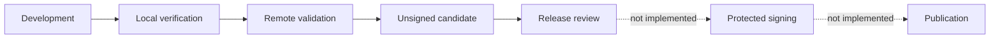

<!-- AUTO-GENERATED:backlink START -->
[← Back](tools.md)
<!-- AUTO-GENERATED:backlink END -->
# Release and desktop packaging model

| Field | Value |
| --- | --- |
| Status | Active |
| Owner | SunoDM maintainers |
| Last review | 2026-08-25 |
| Audience | Release operators and desktop developers |
| Related ATP | [ATP-0013: End-to-end offline workflow](../atp/active/ATP-0013-end-to-end-offline-workflow.md) |
| Release state | Not approved; remote validation NOT RUN |

## Purpose

This document separates local verification, remote release validation, unsigned desktop candidates, signing, publication, and deployment for SunoDM. The repository contains product-owned CI and release-validation definitions, but their presence is not execution evidence and does not authorize a release.

## Current availability

### Included in the repository

- local product/version and identity checks;
- frontend and native test/build commands;
- unsigned Windows, macOS, and Linux verification paths;
- manual or version-tag release validation;
- SPDX JSON dependency-SBOM generation in release validation; and
- short-lived validation artifacts.

### Not implemented or authorized

- Windows or macOS signing;
- Apple notarization;
- updater keys or endpoints;
- GitHub Release or package-registry publication;
- application-store submission;
- deployment; and
- production release credentials.

Remote workflow execution, Windows/macOS bundles, signing, notarization, and publication remain `NOT RUN`. No checked-in workflow publishes a release.

## Responsibility flow



Only the solid-line path is defined by this repository. Signing and publication require a separate reviewed product integration and authority.

## Version and identity sources

`VERSION` is the product version source. Enabled component metadata mirrors it in:

- `frontend/package.json` and `frontend/package-lock.json`;
- `src-tauri/tauri.conf.json`;
- `src-tauri/Cargo.toml`; and
- the root package entry in `src-tauri/Cargo.lock`.

The fixed product identity is:

| Field | Value |
| --- | --- |
| Product version | `0.1.0` |
| Display name | `Suno Documentation Manager` |
| Slug, package, and binary | `sunodm` |
| Tauri identifier | `com.grav0id.sunodoc` |
| Active profile | `desktop-local` |
| Enabled features | `frontend`, `tauri` |

The full display name belongs in user-facing titles and in Tauri `productName`; standard Tauri installer and bundle filenames may derive from it. The short `sunodm` identity belongs in the Cargo/npm package identifiers, executable name, and product-owned web, portable, and stable-AppImage artifact names. The existing `sunodm`-derived WiX UpgradeCode is pinned independently so a display-name correction cannot split the Windows MSI upgrade line. Generated products replace that source pin with a target-binary-derived code to prevent cross-product MSI collisions.

Version synchronization is explicit and does not create a tag or release:

```sh
python tools/control.py version
python tools/control.py version sync
python tools/control.py version check
```

## Non-publishing release gate

Run the local gate from a clean candidate worktree:

```sh
python tools/control.py release check
```

It checks version mirrors, tag/version consistency when a tag is present, product identity, Tauri security configuration, and release metadata. It rejects a dirty tree. An unsigned-signing warning does not turn an artifact into a production release.

The gate neither signs nor publishes. During the migration, a dirty-tree rejection is expected state evidence and must not be reported as a passing release gate.

## Desktop verification matrix

`.github/workflows/desktop.yml` runs natively on Ubuntu, macOS, and Windows. It exercises the portable analyzer, Tauri diagnostics, native tests, and an unsigned package build before creating one validated prearchive per runner.

| Target | Default verification | Uploaded archive |
| --- | --- | --- |
| Linux | Unsigned DEB | `sunodm-desktop-linux-unsigned.tar.gz` |
| macOS | Technically available unsigned Tauri bundles | `sunodm-desktop-macos-unsigned.tar.gz` |
| Windows | Technically available unsigned Tauri bundles | `sunodm-desktop-windows-unsigned.zip` |

Release Validation requests Linux DEB, RPM, and AppImage candidates and requires the generated Linux bundle manifest and SHA-256 list before upload. These files establish only technical build evidence for the runner environment. They are not signed installers, public releases, or broad distribution-compatibility claims.

## Release-validation trigger

`.github/workflows/release.yml` accepts `workflow_dispatch` and tags matching `v*.*.*`. It runs release-strict quality, documentation checks, the complete applicable test suite, web build, `release check`, SPDX SBOM generation, and the reusable unsigned desktop matrix. The validation artifacts are retained temporarily in the workflow artifact store.

The workflow has read-only repository permission and contains no release-creation or deployment job. Pushing a matching tag would trigger validation, not publication. Tag creation itself is outside this migration and requires separate authorization.

## Source and third-party licensing

The product source is governed by the root `LICENSE` and `NOTICE`. That product license does not replace the licenses of bundled fonts, native sidecars, vendored Rust code, npm packages, or Cargo dependencies. Before any distributable candidate is approved, the operator must verify the reviewed third-party notice inventory, include every required full license/provenance/source-offer file in the bundle, and confirm that packaged resources match the approved Tauri configuration.

Release validation can detect structural omissions, but it is not legal advice and does not by itself establish distribution compliance.

## Signing, notarization, and updater boundary

No signing value is committed or consumed by normal CI. A future signing design must isolate platform credentials in protected jobs and environments, restrict write permission to the final reviewed publication step, remove temporary key material unconditionally, and prevent fork pull requests from reaching secrets.

The auto-updater is absent. Activating it requires a real HTTPS endpoint, an offline-generated updater signing key, a committed public verification key, rollback behavior, and a signed publication path. Placeholder URLs or dummy keys are not acceptable.

## Release checklist

The technical candidate checklist is:

```sh
python tools/control.py doctor
python tools/control.py config doctor
python tools/control.py quality --release
python tools/control.py test --suite all --report
python tools/control.py docs check
python tools/control.py version check
python tools/control.py build web
python tools/control.py tauri doctor
python tools/control.py build desktop --dry-run --no-clean
python tools/control.py release check
```

Before distribution, also verify product icons and names, identifier ownership, privacy declarations, product and third-party licenses/notices, sidecar and font provenance, SBOM output, changelog, platform entitlements, certificate validity, signing recovery access, cross-platform results, and the exact approved commit.

Every result must be recorded honestly as `PASS`, `FAIL`, `SKIP`, `NOT RUN`, or `NOT APPLICABLE`. A local Linux dry run cannot prove native Windows or macOS packaging.

## Verification ownership

Workflow structure is covered by `tools/tests/test_ci_workflows.py`. Identity and release-gate behavior are covered by `tools/tests/test_container_release.py` and profile/lifecycle tests. These tests validate repository contracts; they do not prove a GitHub workflow ran.

## Related documents

- [Continuous integration](ci.md)
- [Tooling guide](tooling.md)
- [Tauri desktop development](tauri/tauri.md)
- [Code quality](../def/code-quality.md)
- [Template lifecycle](../def/template-lifecycle.md)
- [Template v1.0.3 migration plan](../dev/migrations/template-v1.0.3/migration-plan.md)
